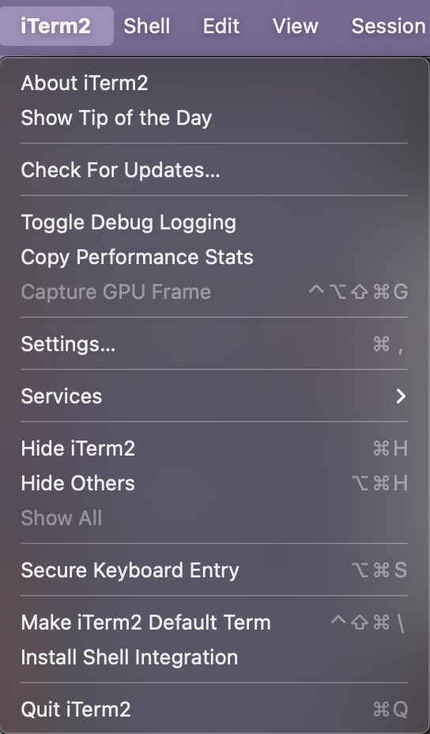

# Enviroment_files

Configuration files for my environment

## Install Brew

```bash
/bin/bash -c "$(curl -fsSL https://raw.githubusercontent.com/Homebrew/install/HEAD/install.sh)"
```

## Setup iTerm2

Install:

```bash
brew install --cask iterm2
```

Setup profile:
Import `York.json` to iTerm2

Disable `Secure Keyboard Entry`:


## Setup zsh

Install oh-my-zsh:

```bash
sh -c "$(curl -fsSL https://raw.githubusercontent.com/ohmyzsh/ohmyzsh/master/tools/install.sh)"
```

Run `install.sh` to link all required config file to root directory:

```bash
sh install.sh
```

Install powerlevel-10k:

```bash
git clone --depth=1 https://github.com/romkatv/powerlevel10k.git ${ZSH_CUSTOM:-$HOME/.oh-my-zsh/custom}/themes/powerlevel10k
```

Install Meslo Nerd Font:

- [MesloLGS NF Regular.ttf](https://github.com/romkatv/powerlevel10k-media/raw/master/MesloLGS%20NF%20Regular.ttf)

- [MesloLGS NF Bold.ttf](https://github.com/romkatv/powerlevel10k-media/raw/master/MesloLGS%20NF%20Bold.ttf)
- [MesloLGS NF Italic.ttf](https://github.com/romkatv/powerlevel10k-media/raw/master/MesloLGS%20NF%20Italic.ttf)
- [MesloLGS NF Bold Italic.ttf](https://github.com/romkatv/powerlevel10k-media/raw/master/MesloLGS%20NF%20Bold%20Italic.ttf)

## Install application

### Development

```bash
brew install --cask \
alt-tab \
rectangle \
stats \
visual-studio-code \
postman \
docker \
1password
1password-cli \
tableplus \
redisInsight \
altair-graphql-client
```

### General

```bash
brew install --cask \
brave \
appcleaner \
notion \
discord \
spotify \
slack \
telegram-desktop
```

## Install development binary

```bash
brew install \
z \
tmux \
k9s \
wrk
```

## Install languages from official website

- [Golang](https://go.dev/)
- [Node](https://nodejs.org/en)
